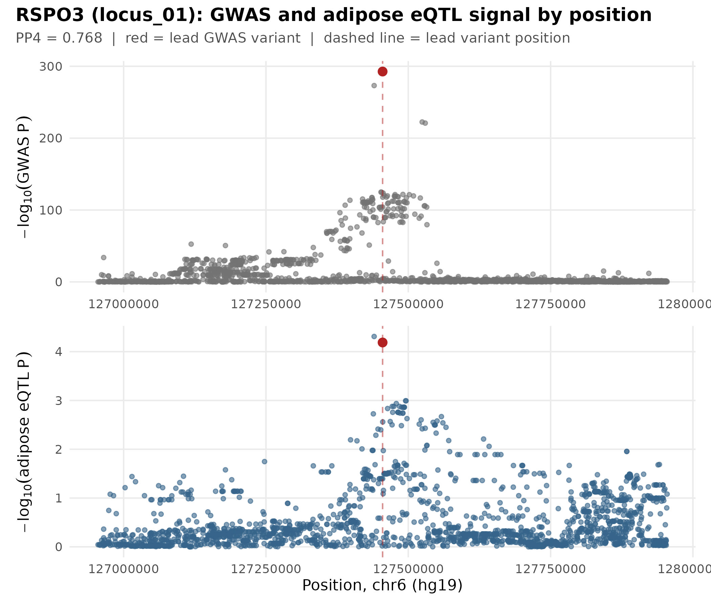
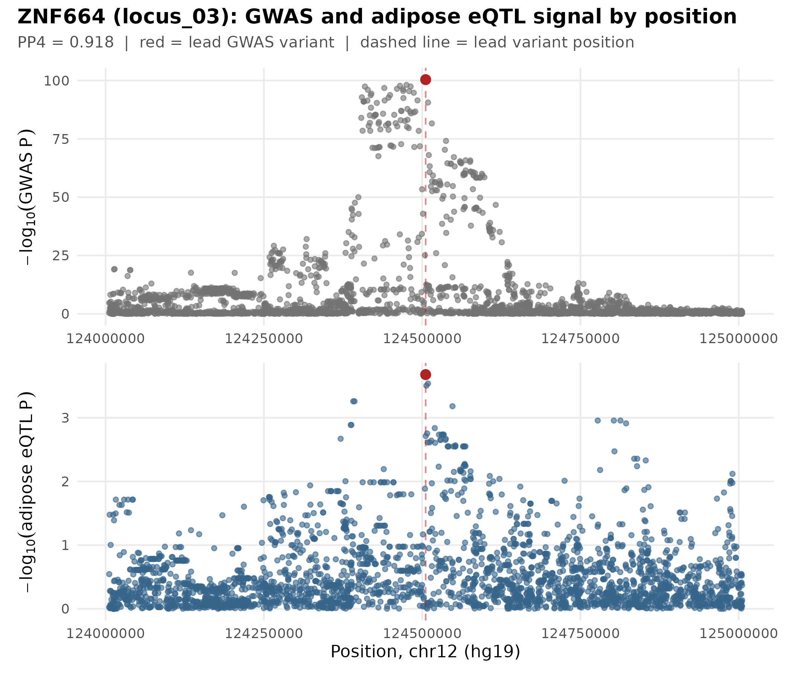
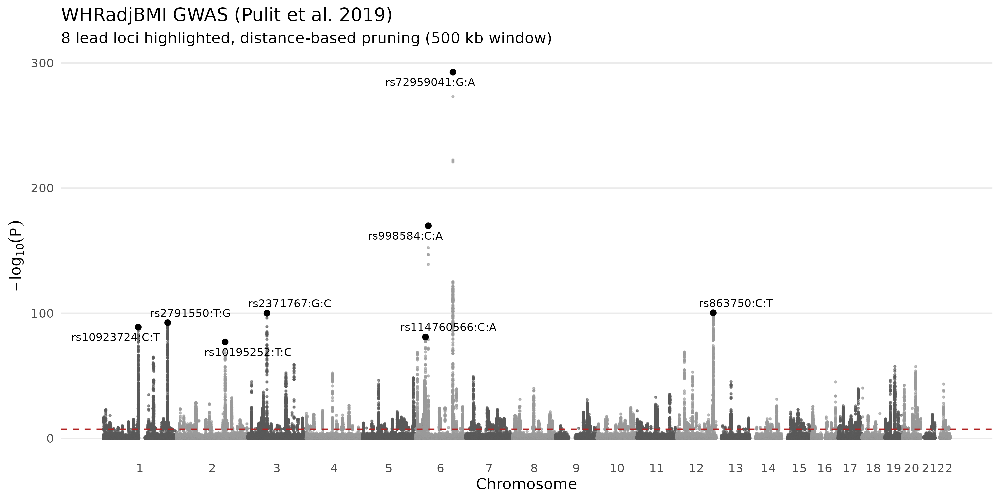
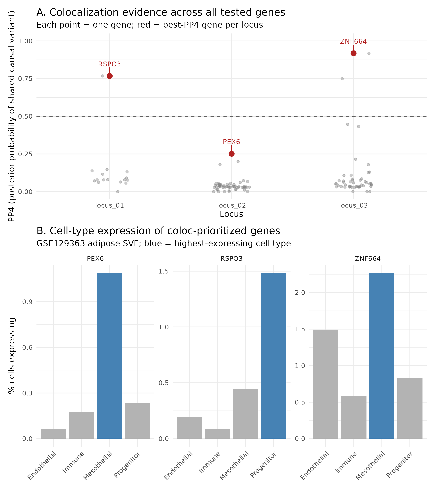
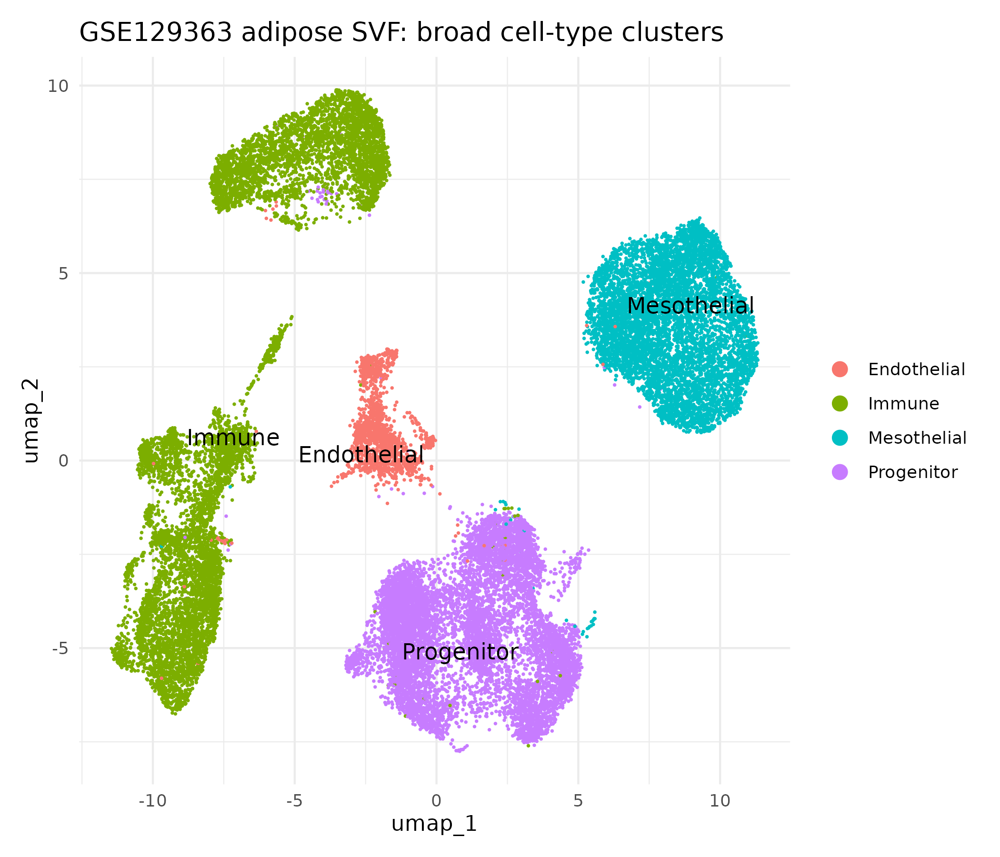
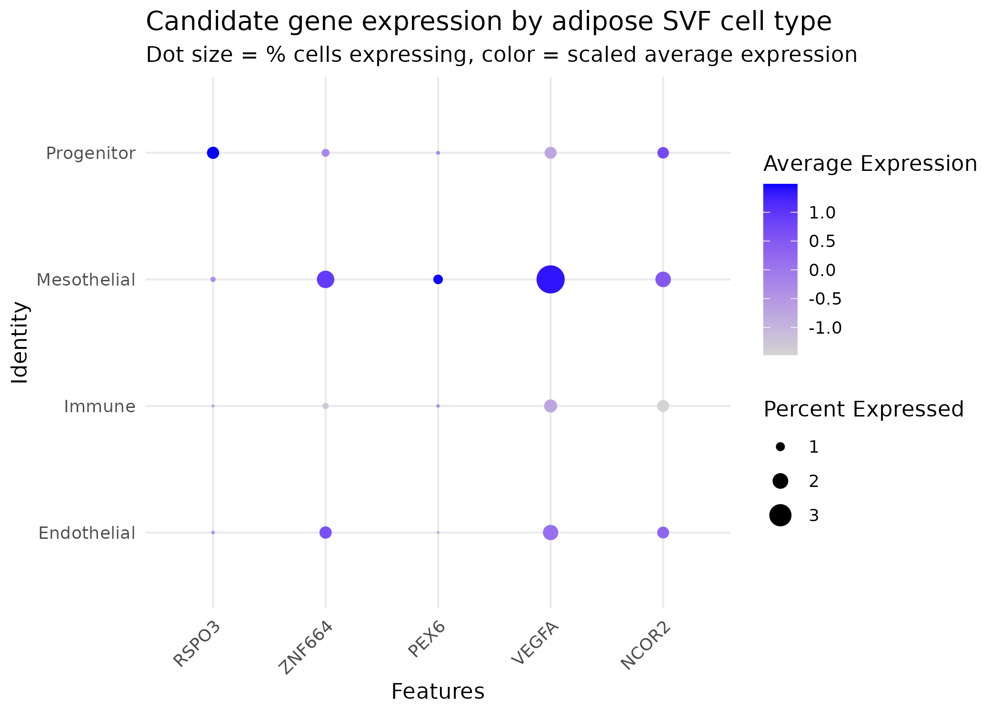

# From adiposity-associated GWAS loci to adipose cell types: integrating WHRadjBMI GWAS, adipose eQTLs and single-cell transcriptomics

  

## Overview

This project integrates three layers of evidence — genome-wide association data,
adipose cis-eQTL data, and single-cell transcriptomics — to nominate candidate
genes and adipose cell populations that may mediate the genetic effect of
specific loci on waist-to-hip ratio adjusted for BMI (WHRadjBMI), a measure of
body-fat distribution. The project is hypothesis-generating and
prioritization-oriented: it does not establish causality for any gene or cell
type.

## Key results at a glance

Two loci show strong colocalization evidence between the GWAS and adipose
eQTL signal: **RSPO3** (PP4=0.77, enriched in adipose progenitor cells) and
**ZNF664** (PP4=0.92, enriched in a visceral-specific mesothelial-derived
population). At both loci, the GWAS and eQTL signal peaks visibly align at
the same genomic position (dashed line = lead GWAS variant):

<p align="center">
  
  
</p>

At both of these loci's neighbors, the "obvious" nearest gene (VEGFA, NCOR2)
did **not** colocalize — direct evidence that proximity to a GWAS hit is not
the same as regulatory relevance.

<p align="center">
  
</p>

## Research question

Which genes and adipose cell populations plausibly mediate genetic effects on
body-fat distribution, as captured by WHRadjBMI?

## Biological rationale

WHRadjBMI captures aspects of body-fat distribution independent of overall
adiposity (BMI is regressed out of the phenotype). This makes adipose tissue,
and adipose cellular biology specifically, a relevant substrate for
interpreting its genetic architecture — more so than for BMI itself, whose
genetic signal is enriched for central appetite-regulation pathways. Adjusting
for a heritable covariate (BMI) can in principle introduce collider bias at
some loci; this is a known limitation of the WHRadjBMI phenotype definition,
not specific to this analysis.

## Workflow

```
WHRadjBMI GWAS (Pulit et al. 2019)
  -> QC and distance-based locus definition (8 genome-wide significant loci)
  -> liftOver locus windows hg19 -> GRCh38
  -> adipose subcutaneous cis-eQTL retrieval (eQTL Catalogue / GTEx v8)
  -> allele harmonization + colocalization (coloc.abf) at 3 top loci
  -> single-cell mapping into human adipose stromal vascular fraction (GSE129363)
  -> integrated, tiered gene/cell-type prioritization
```

## Data sources

| Layer | Source | Accession / DOI | Build | Access date |
|---|---|---|---|---|
| GWAS | Pulit SL et al. 2019, *Hum Mol Genet* 28(1):166-174 (PMID 30239722) | Zenodo [10.5281/zenodo.1251813](https://zenodo.org/record/1251813), file `whradjbmi.giant-ukbb.meta-analysis.combined.23May2018.txt.gz` | hg19/GRCh37 | 2026-08-15 |
| Adipose eQTL | eQTL Catalogue (EMBL-EBI), r7 release; GTEx v8 adipose subcutaneous | Dataset QTD000116, study QTS000015, n=581 | GRCh38 | 2026-08-15 |
| Single-cell | Vijay J et al. 2020, *Nat Metab* (PMID 32066997, [DOI](https://doi.org/10.1038/s42255-019-0152-6)) | GEO [GSE129363](https://www.ncbi.nlm.nih.gov/geo/query/acc.cgi?acc=GSE129363), Discovery Cohort processed matrix | GRCh38 (Cell Ranger v2.1.0) | 2026-08-15 |
| liftOver chain | UCSC Genome Browser | `hg19ToHg38.over.chain.gz` | -- | 2026-08-15 |

GWAS data: CC-BY 4.0. eQTL Catalogue and GEO data: publicly available for
research use per their respective repository terms.

## Methods

**GWAS QC and locus selection.** The full summary statistics (27,375,636
variants) were checked for column completeness, duplicate variants, allele
validity, and value-range sanity (P, frequency, beta/SE). 706 variants
(0.0026%) lacking chromosome/position/N annotation were excluded; none reached
genome-wide significance (min P = 1.6x10^-5 among these). Independent loci were
defined via **distance-based greedy pruning** (iteratively selecting the most
significant remaining variant as a lead SNP and excluding a +/-500kb window
around it) at variants with P < 5x10^-8 (54,362 variants). This is an
**approximation to true LD-clumping** -- no LD reference panel was used, since
`coloc.abf` does not require one. 8 independent loci were identified.

**eQTL retrieval.** Each locus's +/-500kb window was lifted from hg19 to
GRCh38 (100% width retention for all 8 loci, single target chromosome each).
Adipose subcutaneous cis-eQTL associations (GTEx v8, eQTL Catalogue dataset
QTD000116) were retrieved via remote tabix range queries
(`Rsamtools::scanTabix`) -- no bulk file was downloaded.

**Allele harmonization and colocalization.** GWAS and eQTL variants were
merged on shared rsID. Alleles were classified as direct match, flipped match
(beta sign and frequency inverted to align with the eQTL Catalogue's `alt`
allele, confirmed as the effect allele from
[official documentation](https://github.com/eQTL-Catalogue/eQTL-Catalogue-resources/blob/master/tabix/Columns.md)),
palindromic (A/T, C/G -- excluded, 14.2% of merged rows), or mismatched
(excluded, 0.09% of merged rows). `coloc.abf` (default Giambartolomei et al.
2014 priors: p1=p2=1x10^-4, p12=1x10^-5) was run for every gene present at the
3 most significant loci (122 gene-locus pairs, minimum 30 SNPs required per
test).

**Single-cell processing.** The GSE129363 Discovery Cohort matrix (38,170
cells) was subset to the 26,350 cells the original authors retained after
their own QC (confirmed against their published Methods). Standard Seurat
processing (`NormalizeData`, `FindVariableFeatures`, PCA, graph-based
clustering, UMAP) produced 12 clusters, annotated into 4 broad categories
(Progenitor, Immune, Endothelial, Mesothelial) via canonical marker module
scores (`PDGFRA`/`DCN`/`LUM`; `PTPRC`; `PECAM1`/`VWF`; `MSLN`/`UPK3B`/`KRT19`
respectively), requiring a genuinely positive module score (>0.1) rather than
a forced argmax. This 4-category scheme is a deliberate simplification of the
original publication's ~24 fine subclusters, scoped to what canonical markers
can reliably resolve within this project.

## Repository structure

```
whradjbmi_adipose_genomics/
├── config/config.yml       # all thresholds, windows, paths, seed
├── scripts/                # numbered pipeline scripts, run in order
├── results/
│   ├── figures/             # all output figures (PNG, 300dpi)
│   ├── tables/               # all output tables (CSV)
│   └── logs/                  # per-script run logs (QC summaries, checkpoints)
├── docs/manuscript_summary.md  # full abstract/background/methods/results write-up
├── data/                    # NOT tracked in git -- see Reproducibility
├── renv.lock                # exact package versions
└── README.md
```

## Reproducibility

- R 4.6.1, package versions pinned in `renv.lock` (253 packages). Restore with
  `renv::restore()`.
- Raw data (`data/raw/`) and processed intermediates (`data/interim/`,
  `data/processed/`) are gitignored -- they are large (the GWAS file alone is
  ~650MB) and fully regenerable by rerunning the numbered scripts in
  `scripts/` in order against the data sources listed above.
- All random seeds are set from `config/config.yml` (`seed: 20260815`).
- Figures are rendered with `ragg::agg_png()`, not base `png()`, for
  byte-reproducible output across machines (`ragg` is renv-pinned; system
  graphics devices are not).
- Every script writes a timestamped log to `results/logs/`.

**Quick start:**

```bash
git clone git@github.com:ImmunoScholar/whradjbmi-adipose-genomics.git
cd whradjbmi-adipose-genomics
Rscript -e 'renv::restore()'

# Download data sources into data/raw/ per paths in config/config.yml, then:
Rscript scripts/01_gwas_qc.R
Rscript scripts/02_locus_selection.R
Rscript scripts/03_eqtl_integration.R
Rscript scripts/04_harmonize_coloc.R
Rscript scripts/05_load_singlecell.R
Rscript scripts/06_singlecell_seurat.R
Rscript scripts/06b_cluster_diagnosis.R
Rscript scripts/07_candidate_gene_mapping.R
Rscript scripts/08_final_prioritization.R
Rscript scripts/09_integrated_figure.R
Rscript scripts/10_locus_zoom_figure.R
```

## Results

**8 genome-wide significant loci** were identified, all corresponding to
well-established WHR loci in the literature (RSPO3, VEGFA-adjacent, NCOR2/
CCDC92/DNAH10 cluster, ADAMTS9, LYPLAL1, TBX15-WARS2, an HMGA1-adjacent
region, and COBLL1-GRB14) -- consistent with this analysis correctly
recovering the trait's known genetic architecture.

Colocalization was performed at the 3 most significant loci:

| Locus | Lead SNP | GWAS P | Best gene | PP4 | Tier | Top cell type (fold-enrichment) |
|---|---|---|---|---|---|---|
| locus_01 | rs72959041 (chr6) | 2.08x10^-293 | **RSPO3** | 0.768 | Tier 1: Strong | Progenitor (6.1x) |
| locus_02 | rs998584 (chr6) | 1.22x10^-170 | PEX6 | 0.252 | Tier 2: Suggestive | Mesothelial (6.9x) |
| locus_03 | rs863750 (chr12) | 4.17x10^-101 | **ZNF664** | 0.918 | Tier 1: Strong | Mesothelial (2.3x) |

See the locus-zoom plots above for RSPO3 and ZNF664. A summary view across
all tested genes and the winning genes' cell-type expression:

<p align="center">
  
</p>

At locus_02 and locus_03, the physically nearest/eponymous gene did **not**
colocalize: VEGFA (locus_02) showed PP3=0.764 (evidence for two distinct
causal variants, not a shared one), and NCOR2 (locus_03) showed PP4=0.047
with a flat, non-differential cell-type expression pattern -- illustrating
directly why proximity is not evidence of a shared causal mechanism.

The single-cell cell-type composition (Progenitor 34.3%, Immune 34.5%,
Mesothelial 25.4%, Endothelial 5.8%) closely matches the original publication's
reported proportions (~55-60% combined progenitor lineage, ~34-37% immune,
~6-8% endothelial). The Mesothelial cluster is 99.96% VAT-derived (6,697/6,700
cells), consistent with the source publication's finding that this progenitor
subtype originates from the visceral mesothelium.

<p align="center">
  
  
</p>

The remaining 5 loci (locus_04 through locus_08) have GWAS-level evidence only
-- eQTL/colocalization/single-cell integration was scoped to the 3 most
significant loci and was not performed for these, by design (see Limitations).

Full outputs: `results/tables/08_final_prioritization.csv` (all 8 loci),
`results/tables/08_nearest_vs_coloc_contrast.csv` (the proximity-vs-coloc
comparison), `docs/manuscript_summary.md` (full write-up), and
`results/figures/` (all figures).

## Limitations

- **Ancestry**: the GWAS is European-ancestry only; GTEx is ~85% European.
  Colocalization assumes comparable LD structure between the two datasets,
  which is only approximately true here.
- **No LD reference panel** was used for locus definition; distance-based
  pruning is an approximation to LD-clumping and may occasionally define
  locus boundaries differently than a true clumping algorithm would,
  particularly in regions of complex LD.
- **BMI-adjustment collider bias** is a known possible feature of the
  WHRadjBMI phenotype and was not specifically tested for at any locus here.
- **Single-cell data is stromal vascular fraction only** -- mature adipocytes
  are removed during sample preparation and are absent from this dataset.
  Expression patterns here describe SVF populations (progenitors, immune,
  endothelial, mesothelial), not adipocyte-intrinsic expression.
- **Cell-type resolution is deliberately broad** (4 categories) relative to
  the source publication's ~24 fine subclusters, limited by what a small
  canonical marker panel can reliably resolve. Finer sub-classification (e.g.
  distinguishing immune cell subtypes) was out of scope.
- **Colocalization was only performed at 3 of 8 loci**, chosen as the most
  GWAS-significant, per the project's stated scope. This is a real boundary
  on what this analysis can claim, not a completeness gap that was overlooked.
- **No colocalization prior-sensitivity analysis** was performed (i.e.
  whether PP4 results are robust to reasonable variation in the p12 prior).
- Colocalization used a scalar sample size per dataset (median/dataset-level
  N) rather than per-SNP N vectors, a standard simplification.
- **This analysis is hypothesis-generating.** Colocalization evidence
  (PP4) is consistent with, but does not prove, a shared causal variant; cell-
  type expression enrichment is consistent with, but does not establish, a
  causal cell type; and no result here should be interpreted as demonstrating
  disease causality.

## Citation

If referencing the data sources used in this analysis, please cite:

- Pulit SL, Stoneman C, Morris AP, et al. Meta-analysis of genome-wide
  association studies for body fat distribution in 694,649 individuals of
  European ancestry. *Hum Mol Genet*. 2019;28(1):166-174.
- Kerimov N, Hayhurst JD, Peikova K, et al. A compendium of uniformly
  processed human gene expression and splicing quantitative trait loci.
  *Nat Genet*. 2021;53:1290-1299. (eQTL Catalogue)
- Vijay J, Gauthier MF, Biswell RL, et al. Single-cell analysis of human
  adipose tissue identifies depot and disease specific cell types. *Nat
  Metab*. 2020;2:97-109.
- Giambartolomei C, Vukcevic D, Schadt EE, et al. Bayesian test for
  colocalisation between pairs of genetic association studies using summary
  statistics. *PLoS Genet*. 2014;10(5):e1004383. (coloc method)
